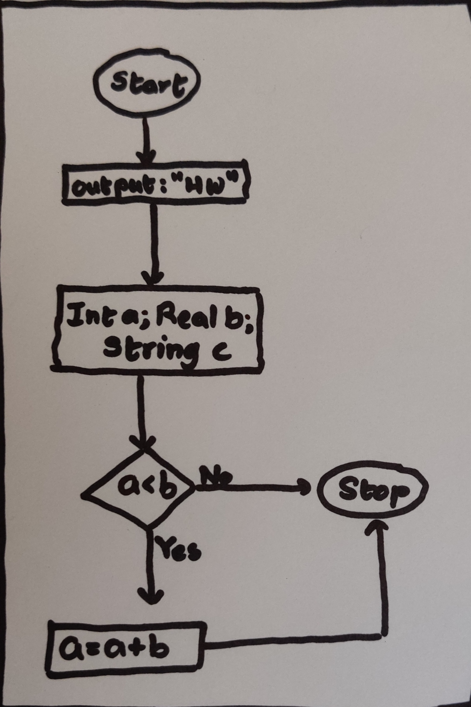

# Four-Point-Invoice-Transform-with-OpenCV

Run `python four_point_object_extractor.py -i <input image> -o <output image>`

For example, `python four_point_object_extractor.py -i sample-flowchart.jpg -o sample-flowchart-cropped.jpg` will give the result-  
